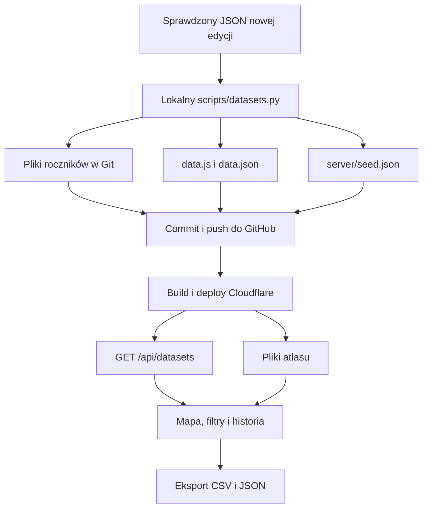

# Architektura i API

Publiczna aplikacja jest przeznaczona wyłącznie do odczytu i eksportu. Obsługuje niezależne miasta i roczniki; obecnie Kraków i Wrocław. Nie ma logowania, importu przez przeglądarkę ani operacji zapisu na serwerze.

## Przepływ danych

```mermaid
flowchart TD
  JSON[Sprawdzony JSON nowej edycji] --> Import[Lokalny scripts/datasets.py]
  Import --> Files[Pliki roczników w Git]
  Import --> Bundle[data.js i data.json]
  Import --> Seed[server/seed.json]
  Files --> Commit[Commit i push do GitHub]
  Bundle --> Commit
  Seed --> Commit
  Commit --> Deploy[Build i deploy Cloudflare]
  Deploy --> API[GET /api/datasets]
  Deploy --> Static[Pliki atlasu]
  API --> UI[Mapa, filtry i historia]
  Static --> UI
  UI --> Export[Eksport CSV i JSON]
```

Interfejs HTML/CSS/JavaScript znajduje się w `licea/public/atlas/`. Leaflet wyświetla mapę, a MarkerCluster grupuje szkoły. `app.js` obsługuje filtry, karty i historię; `data-manager.js` udostępnia eksport. React/Vinext zapewnia trasę odczytu i przekierowanie `/` na atlas.

`bootstrap.js` odczytuje API z limitem 12 sekund. W razie błędu pozostawia dane z dołączonego `data.js` i pokazuje komunikat. Obie kopie są generowane z tych samych roczników przez lokalny importer. D1 nie bierze udziału w odczycie.

## Pliki danych

| Ścieżka w `licea/` | Rola |
| --- | --- |
| `public/atlas/data/rankings-ROK.json` | Wersjonowane migawki roczników, schemaVersion 1 |
| `public/atlas/data/index.json` | Katalog dostępnych lat i rok domyślny |
| `public/atlas/data.js`, `data.json` | Pakiet przeglądarkowy i najnowsza migawka |
| `public/atlas/data/wroclaw/rankings-ROK.json` | Oddzielne migawki Wrocławia; nowe miasta mają analogiczne katalogi |
| `cities.json` | Nazwy miast, centrum mapy i prostokątne zakresy walidacji współrzędnych |
| `server/seed.json` | Katalog miast i roczników dla API odczytu |
| `scripts/datasets.py` | Walidacja, import i generowanie wszystkich kopii, w tym seedów |

Stabilne `schools[].id` łączy szkołę między latami tego samego miasta. Katalog ma strukturę `datasetsByCity[city][year]`. Stare migawki Krakowa pozostały bez przepisywania: brak `city` oznacza `krakow`, a brak `schoolType` oznacza `liceum`. Walidacja dopuszcza współrzędne tylko w obszarze właściwego miasta. Historia szkoły nie przechodzi między miastami. Brak wyniku lub zdawalności nie jest zerem. Schemat i źródła opisuje [DANE.md](../licea/DANE.md).

## API i dostęp

`GET /api/datasets` zwraca `{catalog, revisions: {}}` z nagłówkiem `Cache-Control: no-store`. `catalog` zawiera `defaultCity`, `cities`, `schoolType` i `datasetsByCity`. `revisions` pozostało puste dla zgodności z formatem wcześniejszych odpowiedzi; aplikacja nie prowadzi już rewizji bazy.

Endpointy `/api/import/preview`, `/api/import/prepare` i `/api/import/commit` zostały usunięte, wraz z kodem zapisu D1. Bezpośrednie żądanie do dawnego API również nie zmienia danych. Publiczna mapa i eksport nie wymagają konta. Uprawnienia do zmian wynikają z dostępu do repozytorium GitHub oraz wdrożeń Cloudflare.

`.openai/hosting.json` deklaruje `d1: null`, więc nowy build nie wiąże bazy. Stare rekordy nie zastępują danych z Git. Istniejąca baza i dawne migracje pozostają zachowane; zmiana nie wykonuje żadnego kasowania danych.

## Coroczna publikacja

Właściciel przygotowuje rzeczywisty rocznik dla wybranego miasta, waliduje i importuje go lokalnie, przegląda diff, testuje i wysyła commit z rocznikiem oraz plikami generowanymi. Cloudflare buduje i publikuje nową wersję. Szczegółowe polecenia: [instrukcja aktualizacji](URUCHOMIENIE.md#coroczna-aktualizacja-danych). Kolejne duże miasta oraz osobny model przyszłych szkół podstawowych opisuje [plan rozwoju](ROZWOJ.md).
